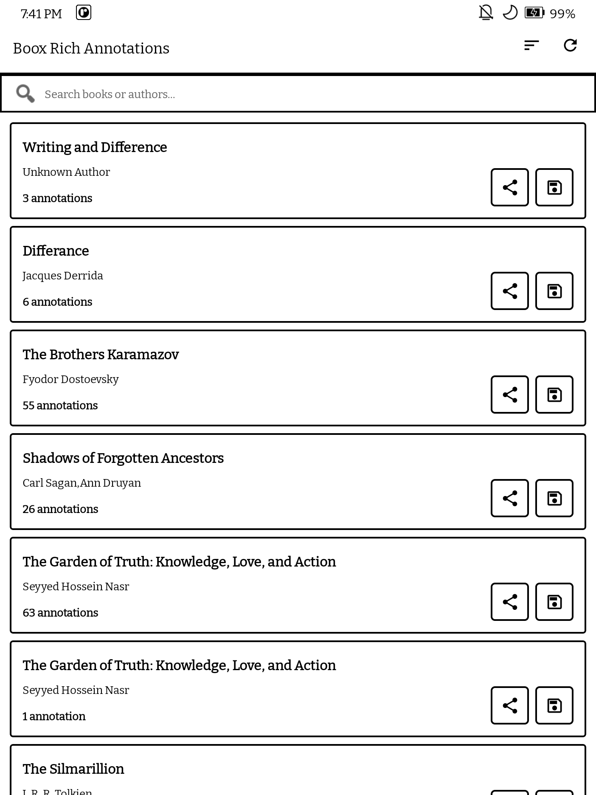
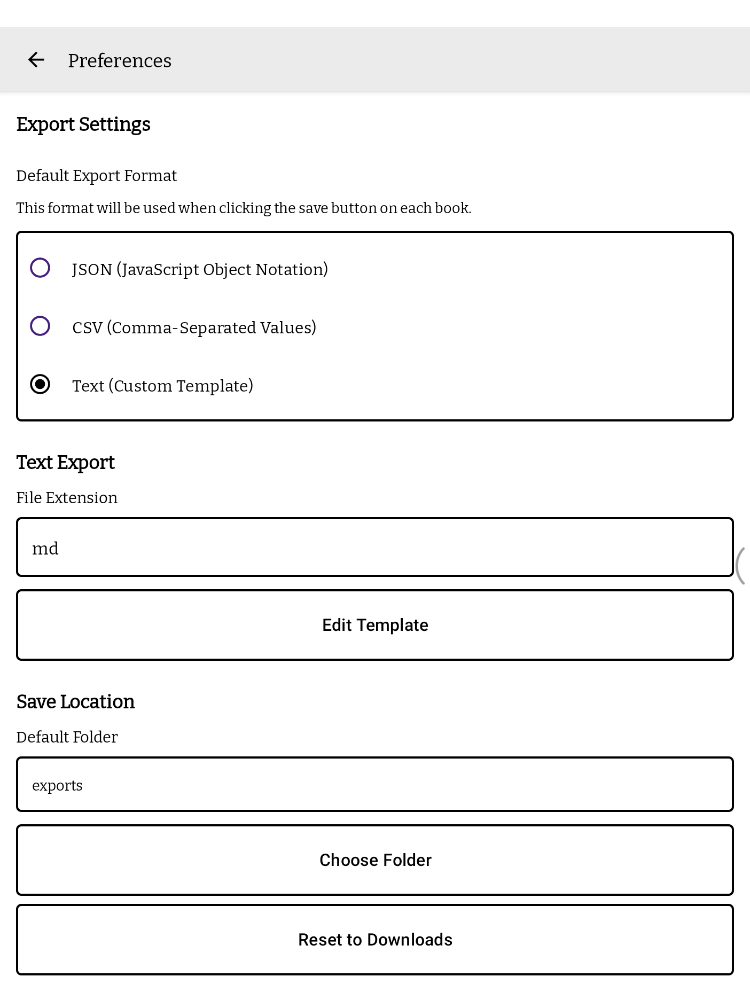
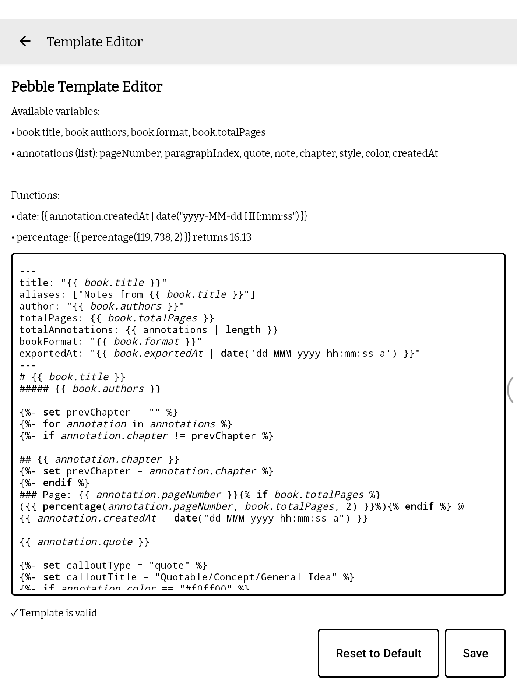

# Boox Rich Annotation

A native Android app for extracting and exporting rich annotations from Onyx Boox e-readers.

## Screenshots

<p align="center">
  
  
  
</p>

## Features

- 📚 **Browse Your Library** - View all your ebooks (EPUB, MOBI, AZW/AZW3) in one place
- 🔍 **Search** - Find books instantly by title or author
- 🎨 **Rich Annotations** - Exports annotations with colors, styles, and notes
- 📥 **Multiple Export Formats** - JSON, CSV, or customizable text (Markdown, etc.)
- ✏️ **Template Editor** - Create custom export templates with Pebble templating engine
- 🎨 **Syntax Highlighting** - Bold keywords, italic variables in template editor for better readability
- 📁 **Custom Save Location** - Choose any folder on your device to save exported files
- ⚙️ **Preferences** - Configure default export format and text templates
- 🔄 **Real-time Refresh** - Fetch latest data on demand
- ⚡ **E-ink Optimized** - Pure black & white theme with zero animations for optimal e-ink display
- 🎯 **No Duplicates** - Automatically deduplicates edited annotations

## Supported Annotation Styles

- Highlight (filled)
- Underline (straight)
- Dashed underline
- Wavy underline
- Redact
- Mute

## Export Formats

### JSON
```json
{
  "title": "Book Title",
  "authors": "Author Name",
  "format": "epub",
  "totalPages": 300,
  "exportedAt": 1718465887527,
  "annotations": [
    {
      "quote": "Selected text...",
      "pageNumber": 42,
      "chapter": "Chapter Name",
      "createdAt": 1781261518476,
      "color": "#a020f0",
      "style": "highlight",
      "note": "Optional note text"
    }
  ]
}
```

### CSV
Simple spreadsheet format with columns:
- Page, Quote, Chapter, Style, Color, Note, Created At

### Text (Customizable)
Export to Markdown or any text format using Pebble templates. The default template includes:
- Title and author header
- Annotations grouped by chapter
- Page numbers with timestamps
- Color and style information
- Metadata table with export timestamp

**Available template variables:**
- `book.title`, `book.authors`, `book.format`, `book.totalPages`, `book.exportedAt`
- `annotations` (list): `pageNumber`, `quote`, `note`, `chapter`, `style`, `color`, `createdAt`

**Available template functions:**
- `date` filter: `{{ timestamp | date("yyyy-MM-dd HH:mm:ss") }}`
- `percentage`: `{{ percentage(annotation.pageNumber, book.totalPages, 2) }}` - calculates percentage with precise decimal formatting

## Installation

### Requirements
- Android 7.0 (API 24) or higher
- Onyx Boox device with NeoReader app installed

### Install from APK
1. Download the latest APK from the [Releases](../../releases) page
2. Enable "Install from Unknown Sources" in your device settings
3. Install the APK
4. Open the app and grant necessary permissions

### Build from Source
```bash
git clone https://github.com/yourusername/BooxRichAnnotation.git
cd BooxRichAnnotation
./gradlew assembleDebug
```

The APK will be available at: `app/build/outputs/apk/debug/app-debug.apk`

## How It Works

The app queries Onyx's internal content provider to access:
- **Metadata** - Book information (title, author, format, etc.)
- **Annotations** - Highlights, notes, and their metadata

No file parsing or external storage access needed - everything is fetched directly from the Onyx system database.

## Technical Details

### Content Providers
- Authority: `com.onyx.content.database.ContentProvider`
- Tables: `Metadata`, `Annotation`
- Requires Android 11+ package visibility declaration

### Deduplication Logic
When you edit an annotation (change color, add notes, etc.), Onyx creates a new entry. The app automatically:
1. Groups annotations by their unique identifier (quote + location)
2. Keeps only the most recent version (highest `updatedAt` timestamp)
3. Ensures you see the current state of each annotation

### E-ink Optimizations
- All animations disabled
- Pure white (#FFFFFF) background
- Pure black (#000000) text and borders
- 2dp bold outlines on all UI elements
- Zero elevation/shadows

## Project Structure

```
app/src/main/
├── java/.../booxrichannotation/
│   ├── MainActivity.kt              # Book list screen
│   ├── BookDetailActivity.kt        # Annotation detail screen
│   ├── PreferencesActivity.kt       # Settings screen
│   ├── TemplateEditorActivity.kt    # Template editor
│   ├── BookAdapter.kt               # RecyclerView adapter with export logic
│   ├── OnyxContentProvider.kt       # Content provider helper
│   ├── BookMetadata.kt              # Book data model
│   └── Annotation.kt                # Annotation data model
└── res/
    ├── layout/                      # UI layouts
    ├── menu/                        # Toolbar menus
    ├── drawable/                    # Backgrounds, icons
    └── values/                      # Themes, strings, colors
```

## Permissions

- **QUERY_ALL_PACKAGES** - Required on Android 11+ to access Onyx content provider
- **WRITE_EXTERNAL_STORAGE** - Only on Android 9 and below for file downloads

## Compatibility

Tested on:
- Onyx Boox Tab Mini C (Android 11)
- Other Onyx Boox devices should work if they use the NeoReader app

## Known Limitations

- Only works on Onyx Boox devices (uses proprietary content provider)
- Requires the official Onyx NeoReader app to be installed
- Cannot modify or delete annotations (read-only access)

## License

MIT License - see [LICENSE](LICENSE) file for details

## Contributing

Contributions are welcome! Please feel free to submit a Pull Request.

## Support

If you encounter any issues or have suggestions, please open an issue on GitHub.

