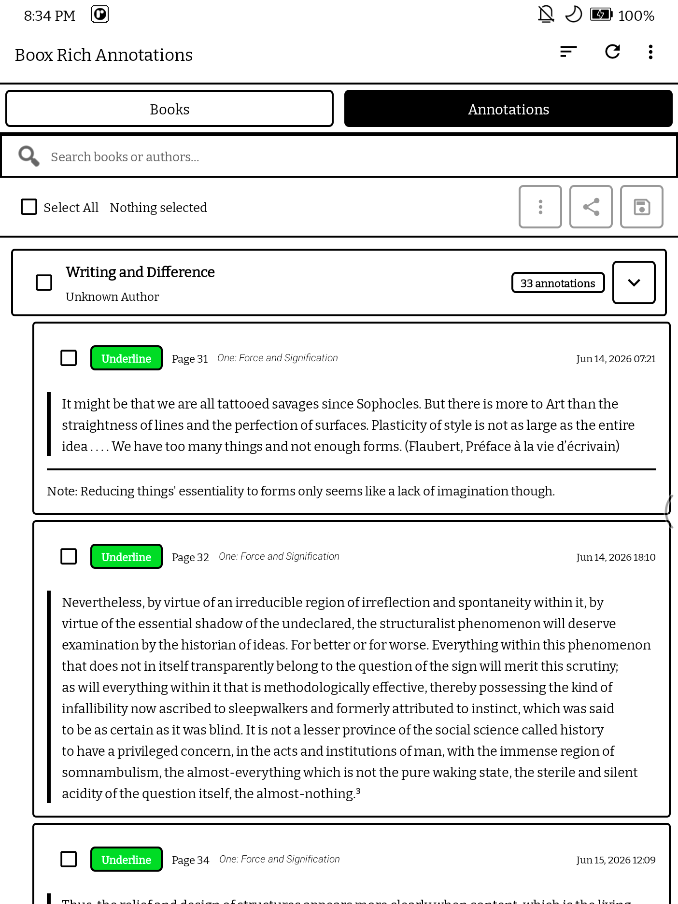
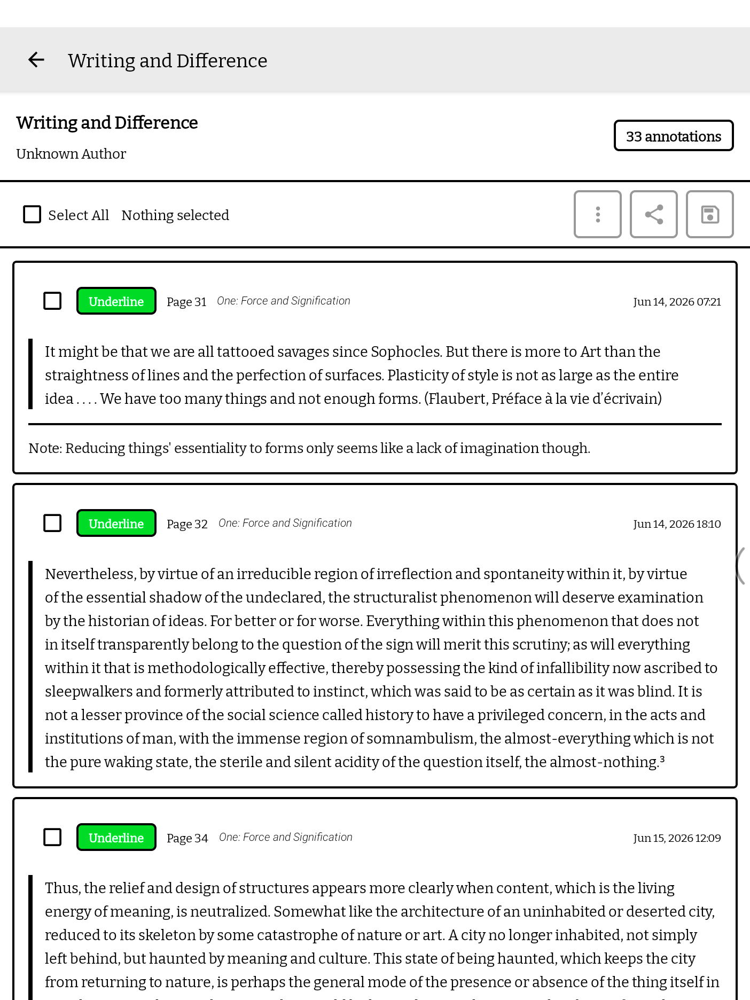

# Boox Rich Annotation

A native Android app for extracting and exporting rich annotations from Onyx Boox e-readers.

## Screenshots

<p align="center">
  
  
  
  
  
</p>

## Features

- 📚 **Browse Your Library** - View all your ebooks (EPUB, MOBI, AZW/AZW3) in one place
- 🔍 **Search** - Find books instantly by title or author
- 🗂️ **Books & Annotations Tabs** - Browse by book, or see every annotation from every book grouped under collapsible book headers in one scrollable list
- 📖 **Book Detail View** - Tap into a book to see each annotation as its own card (style, page, chapter, timestamp, quote, note)
- ✅ **Bulk Selection & Export** - Select individual annotations, a whole book at once, or everything across multiple books, then share/save just that selection
- 🎨 **Rich Annotations** - Exports annotations with colors, styles, and notes
- 📥 **Multiple Export Formats** - JSON, CSV, or customizable text (Markdown, etc.), including multi-book exports
- ✏️ **Template Editor** - Create custom export templates with Pebble templating engine
- 🎨 **Syntax Highlighting** - Bold keywords, italic variables in template editor for better readability
- 📁 **Custom Save Location** - Choose any folder on your device to save exported files
- ⚙️ **Preferences** - Configure default export format and text templates
- 🔄 **Real-time Refresh** - Fetch latest data on demand
- ⚡ **E-ink Optimized** - Pure black & white theme with zero animations for optimal e-ink display
- 🎯 **No Duplicates** - Automatically deduplicates edited annotations

## Export Formats

### JSON
```json
{
  "title": "Book Title",
  "authors": "Author Name",
  "format": "epub",
  "totalPages": 300,
  "publisher": "Publisher Name",
  "language": "English",
  "isbn": "978-0-123456-78-9",
  "description": "Book description",
  "exportedAt": 1718465887527,
  "annotations": [
    {
      "quote": "Selected text...",
      "pageNumber": 42,
      "chapter": "Chapter Name",
      "createdAt": 1781261518476,
      "color": "#a020f0",
      "style": "highlight",
      "note": "Optional note text"
    }
  ]
}
```

### CSV
Simple spreadsheet format with columns:
- Book, Author, Page, Quote, Chapter, Style, Color, Note, Created At, Book ID

`Book ID` is a stable per-book identifier (not just the title), useful for joining/filtering rows across multiple exports in a spreadsheet or query tool.

### Text (Customizable)
Export to Markdown or any text format using Pebble templates. The default template includes:
- Title and author header
- Annotations grouped by chapter
- Page numbers with timestamps
- Color and style information
- Metadata table with export timestamp

**Available template variables:**
- `book.title`, `book.authors`, `book.format`, `book.totalPages`, `book.publisher`, `book.language`, `book.isbn`, `book.description`, `book.exportedAt`
- `annotations` (list): `pageNumber`, `quote`, `note`, `chapter`, `style`, `color`, `createdAt`

**Available template functions:**
- `date` filter: `{{ timestamp | date("yyyy-MM-dd HH:mm:ss") }}`
- `percentage`: `{{ percentage(annotation.pageNumber, book.totalPages, 2) }}` - calculates percentage with precise decimal formatting

### Multi-Book Export
From the **Annotations** tab, select annotations across several books at once and export or share them together in any format (JSON, CSV, or Text).

## Installation

### Requirements
- Android 7.0 (API 24) or higher
- Onyx Boox device with NeoReader app installed

### Install from APK
1. Download the latest APK from the [Releases](../../releases) page
2. Enable "Install from Unknown Sources" in your device settings
3. Install the APK
4. Open the app and grant necessary permissions

### Build from Source
```bash
git clone https://github.com/uroybd/BooxRichAnnotations.git
cd BooxRichAnnotations
./gradlew assembleStandardDebug
```

The APK will be available at: `app/build/outputs/apk/standard/debug/app-standard-debug.apk`

## Permissions

- **QUERY_ALL_PACKAGES** - Required on Android 11+ to access Onyx content provider
- **WRITE_EXTERNAL_STORAGE** - Only on Android 9 and below for file downloads

## Compatibility

Tested on:
- Onyx Boox Tab Mini C (Android 11)
- Other Onyx Boox devices should work if they use the NeoReader app

## Known Limitations

- Only works on Onyx Boox devices (uses proprietary content provider)
- Requires the official Onyx NeoReader app to be installed
- Cannot modify or delete annotations (read-only access)

## License

MIT License - see [LICENSE](LICENSE) file for details

## Contributing

Contributions are welcome! Please feel free to submit a Pull Request.

## Support

If you encounter any issues or have suggestions, please open an issue on GitHub.

